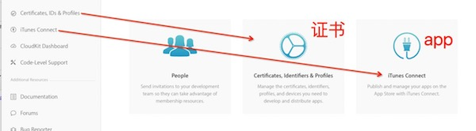
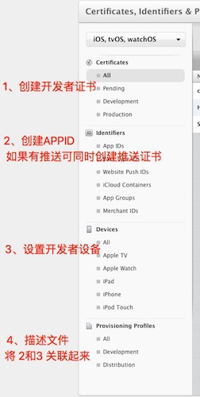
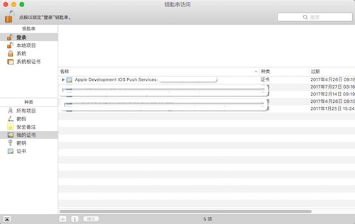

# IOS 开发者证书 申请及使用

## 在本地生成证书

先使用钥匙窜生成证书

## 配置证书

1. 登录 https://developer.apple.com
2. 创建开发者证书，选择你生成的证书文件，continue，done
3. 创建appid（bundle identifier），如果需要选择 push  然后 done

    编辑你的创建的appid，在push项 create push，生成推送证书（和创建开发者证书一样）

4. 添加你真机调试的设备
5. 创建描述文件，关联 appid和设备

## 开始使用啦

1. 选择Certificate，把你创建的证书down下来（cer格式）
2. 安装证书，即双击cer文件

	将你的证书导出 .p12 文件，后续还有转换 pem 等等（还没有研究）

	

3. 下载 prosioning profile 使用xcode打开，我没有看到效果（在code signing - Provisioning Profile 中可以看到）

4. 在Xcode中配置证书

    项目 ---> Build Settings ---> Code signing ---> Code Signing Identity ---> 选择你的证书
    项目 ---> Build Settings ---> Code signing ---> Provisioning Profile ---> 选择你的描述文件

