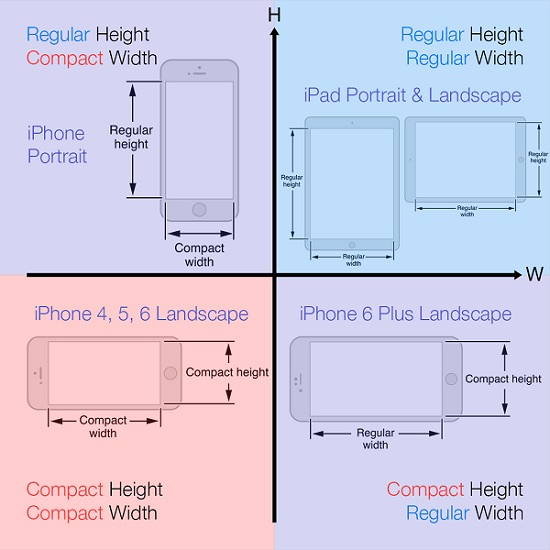
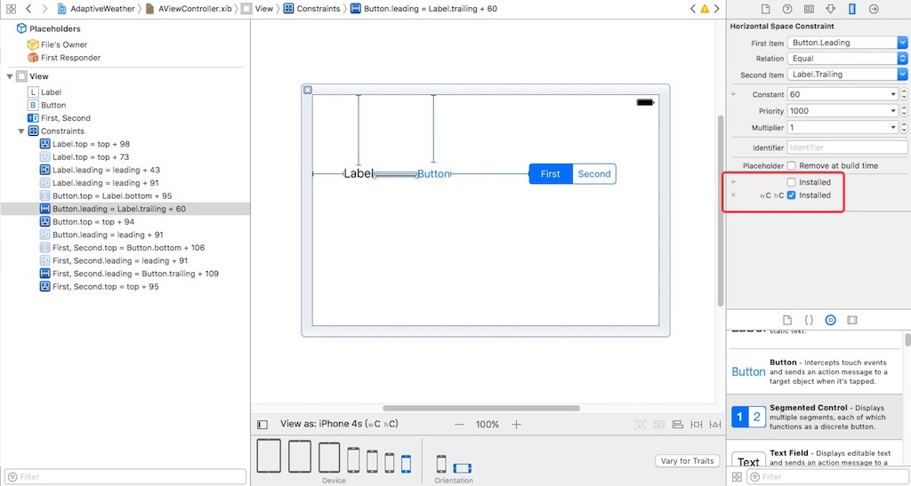

iOS 8在应用界面的可视化设计上添加了一个新的特性 `Size Class`

# 为什么苹果推出SizeClasses
+ iPhone3gs-4s : frame直接写死。
+ iPad : autoresizing —> 根据父控件frame发生改变,子控件跟着一起改变。
+ iPhone5-iPhone5s : autolayout —>自动布局。
+ iPhone6和iPhone6p : size Class—>发现屏幕变的太多样化,界面不得不统一。

# Size Class把宽度和高度各分为3种情况
+ `Compact` : 紧凑(小)
+ `Any` : 任意
+ `Regular` : 宽松(大)

# 竖屏

# 横屏

# 什么时候使用SizeClass?
1. iPhone与iPod通用一个xib或者storyboard
2. 支持横屏

---
参考文章
+ http://www.cnblogs.com/xubaoaichiyu/archive/2016/04/12/5384491.html
+ http://blog.csdn.net/pz0605/article/details/47315495
