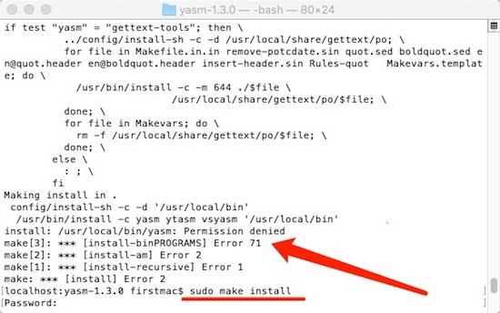

# Mac编译FFmpeg

`FFmpeg` 是一套可以用来记录、转换数字音频、视频，并能将其转化为流的开源计算机程序。采用LGPL或GPL许可证。它提供了录制、转换以及流化音视频的完整解决方案。

## 准备条件

1. 安装 yasm。 解压后
	```
	cd yasm-1.2.0
	./configure
	make
	make install
	```

2. 到 `https://github.com/libav/gas-preprocessor` 下载 `gas-preprocessor.pl` 文件
	复制 `gas-preprocessor.pl` 到 `/usr/bin` 下
	修改文件权限 `chmod 777 /usr/local/bin/gas-preprocessor.pl`

## 开始搭建

1. 下载脚本：`https://github.com/kewlbear/FFmpeg-iOS-build-script`
2. 解压，找到文件 `build-ffmpeg.sh`
3. 执行服本文件：`./build-ffmpeg.sh`, 由于本人没有事先安装Yasm
	
	
	脚本则会自动从`github`中把`ffmpeg`源码下到本地并开始编译。编译结束后，文件目录如下：
	

4. 编译完成后，终端进入 `FFmpeg-iOS-build-script` 目录，然后输入`./build-ffmpeg.sh lipo`，这个命令是将`.a`文件合并成一个
5. 把`ffmpeg-iOS`文件加入到工程中
6. `libz.dylib/libbz2.dylib/libiconv.dylib`是必须要导入的

## 运行编译

1. 编译报 `include“libavformat/avformat.h” file not found` 错误。
	在 `Build Settings`中找到`Search Paths`，设置`Header Search Pahts` 和 `Library Search Paths`。
	修改`Header search paths` 里的路径：`$(PROJECT_DIR)/FFmpeg-iOS/include`

2. `Directly in the engineering of "TARGETS" - > "BuildSettings" - > "Other Linker Flags" click on the "+" to add a "- liconv" item, if you have any questions, welcome to leave a message`

	```
	Undefined symbols for architecture i386:
	  "_iconv", referenced from:
	      _avcodec_decode_subtitle2 in libavcodec.a(utils.o)
	  "_iconv_close", referenced from:
	      _avcodec_open2 in libavcodec.a(utils.o)
	      _avcodec_decode_subtitle2 in libavcodec.a(utils.o)
	  "_iconv_open", referenced from:
	      _avcodec_open2 in libavcodec.a(utils.o)
	      _avcodec_decode_subtitle2 in libavcodec.a(utils.o)
	ld: symbol(s) not found for architecture i386
	clang: error: linker command failed with exit code 1 (use -v to see invocation)
	```

## 2016 09 19 编辑

安装yasm出现问题，首先到官网下载 （我下载的 yasm-1.3.0.tar.gz）解压后，cd 到目录执行：

1. `cd ...`
2. `./configure`
3. `make`
4. `sudo make install（我原来执行的make install 总是不成功）`


