# Oracle VM VirtualBox 安装 Centos7

## 准备工作

+ `centos镜像`文件 可以到官网 https://www.centos.org/ 下载
+ `virtualBox` 可以到官网 https://www.virtualbox.org/ 下载

## 新建虚拟机

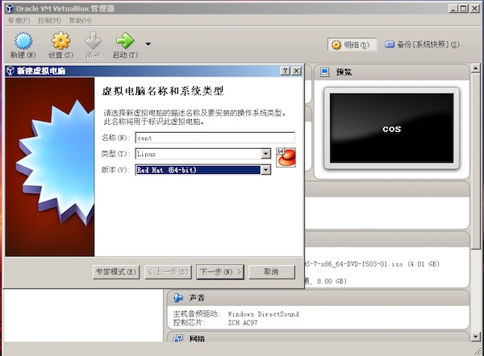

通常都是下一步，注意磁盘选项

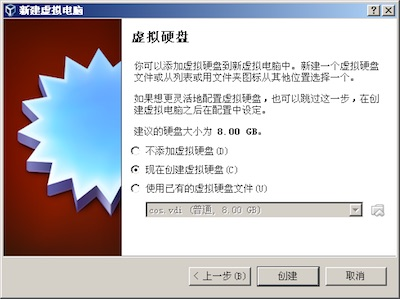
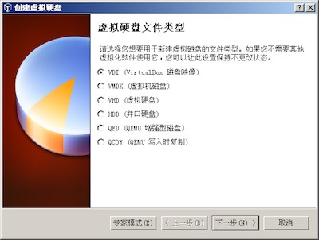
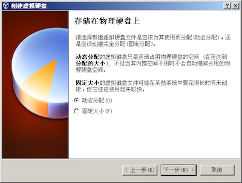
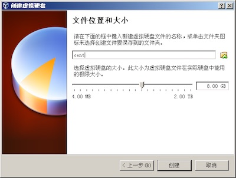

创建完成后，设置镜像文件

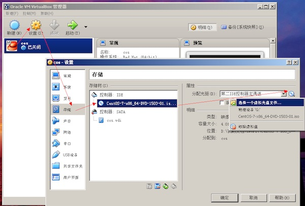

## 启动虚拟机，开始安装

1. 选择 `Install Centos7` 并选择语言（语言可以修改） 点击 下一步
	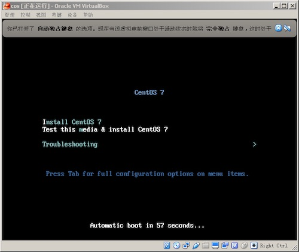

2. 进行以下相关配置，注意分区，点击 `system` 中的 `installation destination`
	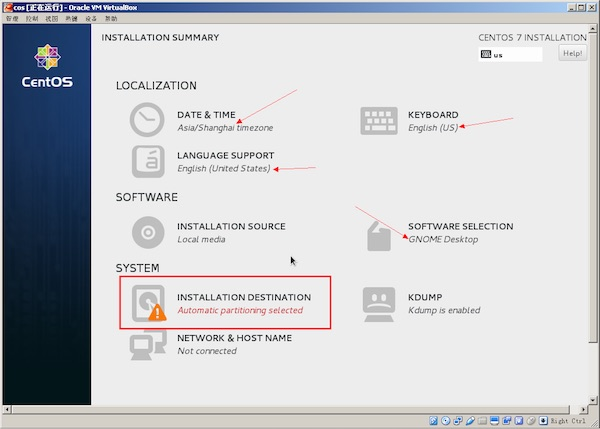

3. 选择 `i will configure partitioning` 自己配置分区
	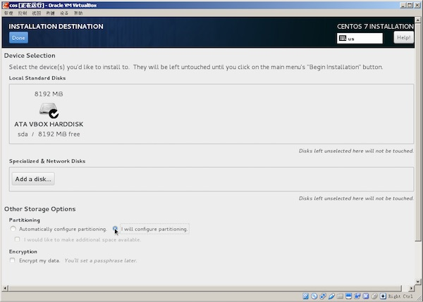

4. 然后点击 `Done` 及 `accept changes`
	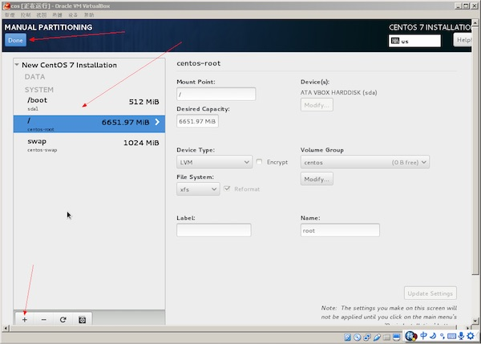
	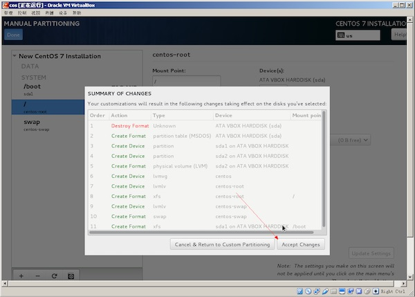

5. 返回主页，点击 `begin installation` 开始安装
	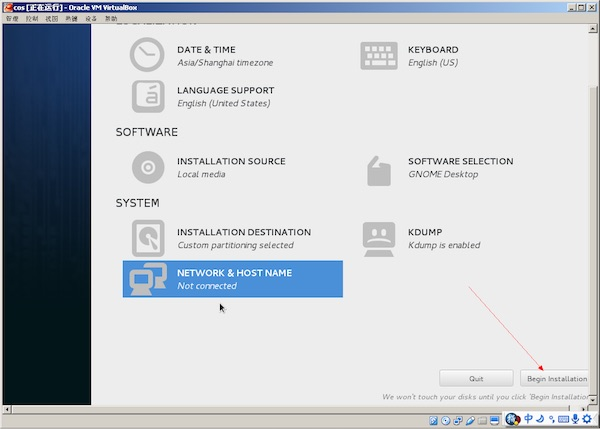

6. 安装过程中，设置root密码及创建用户
	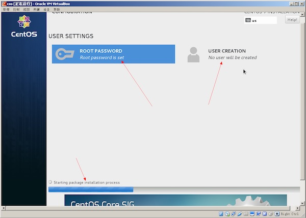

7. 安装完成后，需要 `reboot` 重启
	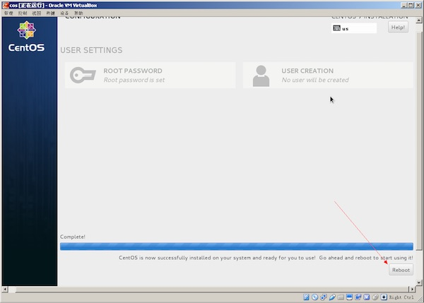

8. centos安装到此结束，开始使用吧
	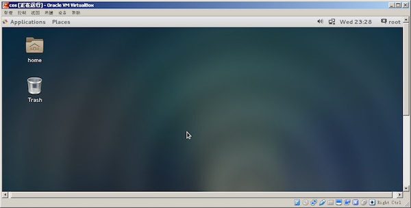

