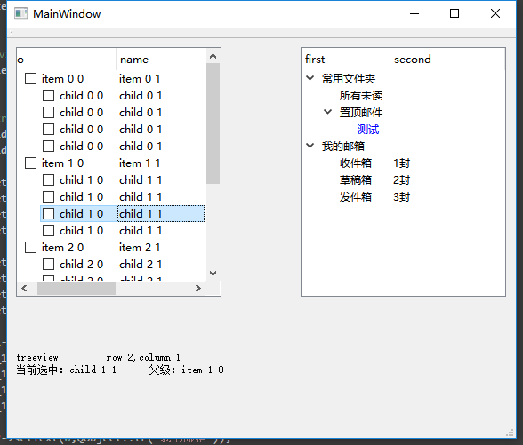

# Qt QTreeVirew 与 QTreeWidget 简单使用

QTreeWidget 是 QTreeView 的子类

Qt中QTreeWidget比QTreeView更简单，但没有QTreeView那么灵活（QTreeWidget封装的和MFC的CTreeCtrl很类似，没有mvc的特点）。



## 初始化

+ 新建 `Widgets 项目`
+ 在 `mainwindow.ui` 文件的设计模式下拖入 `Tree View` 和 `Tree Widget`
+ 编辑 `mainwindow.cpp`，内容

## mainwindow 源码

```
#include "mainwindow.h"
#include "ui_mainwindow.h"
#include <QStandardItemModel>
#include <QStandardItem>

MainWindow::MainWindow(QWidget *parent) :
    QMainWindow(parent),
    ui(new Ui::MainWindow)
{
    ui->setupUi(this);


    // MARK: tree view
    QStandardItemModel *goodsModel = new QStandardItemModel(0, 4,this);
    ui->treeView->setColumnWidth(0,50);
    ui->treeView->setColumnWidth(1,200);
    ui->treeView->setColumnWidth(2,200);
    ui->treeView->setColumnWidth(3,200);
    goodsModel->setHeaderData(0, Qt::Horizontal, tr("No"));
    goodsModel->setHeaderData(1, Qt::Horizontal, tr("name"));
    goodsModel->setHeaderData(2, Qt::Horizontal, tr("value1"));
    goodsModel->setHeaderData(3, Qt::Horizontal, tr("value2"));
    ui->treeView->setModel(goodsModel);
    // 设置数据
    for (int j = 0; j < 4; ++j)
    {
        QList<QStandardItem *> items;
        for (int i = 0; i < 3; ++i)
        {
            QStandardItem *item = new QStandardItem(QString("item %1 %2").arg(j).arg(i));
            if (0 == i)
                item->setCheckable(true);
            items.push_back(item);
        }
        goodsModel->appendRow(items);
        for (int i = 0; i < 4; ++i)
        {
            QList<QStandardItem *> childItems;
            for (int i = 0; i < 3; ++i)
            {
                QStandardItem *item = new QStandardItem(QString("child %0 %1").arg(j).arg(i));
                if (0 == i)
                    item->setCheckable(true);
                childItems.push_back(item);
            }
            items.at(0)->appendRow(childItems);
        }
    }
    //设置treeview 能够被多选
    ui->treeView->setSelectionMode(QAbstractItemView::ExtendedSelection);


    // MARK: tree widget
    ui->treeWidget->setColumnCount(2);
    ui->treeWidget->setHeaderLabels(QStringList()<<"first"<<"second");

    QTreeWidgetItem *rootItem_1 = new QTreeWidgetItem(ui->treeWidget);
    QTreeWidgetItem *childItem_1_1 = new QTreeWidgetItem();
    QTreeWidgetItem *childItem_1_2 = new QTreeWidgetItem();
    QTreeWidgetItem *childItem_1_2_1 = new QTreeWidgetItem();

    QTreeWidgetItem *rootItem_2 = new QTreeWidgetItem(ui->treeWidget);
    QTreeWidgetItem *childItem_2_1 = new QTreeWidgetItem();
    QTreeWidgetItem *childItem_2_2 = new QTreeWidgetItem();
    QTreeWidgetItem *childItem_2_3 = new QTreeWidgetItem();

    rootItem_1->setText(0,QObject::tr("常用文件夹"));
    childItem_1_1->setText(0,QObject::tr("所有未读"));
    childItem_1_2->setText(0,QObject::tr("置顶邮件"));
    childItem_1_2_1->setText(0,QObject::tr("测试"));
    childItem_1_2_1->setForeground(0,QBrush(QColor(Qt::blue)));

    rootItem_2->setText(0,QObject::tr("我的邮箱"));
    childItem_2_1->setText(0,QObject::tr("收件箱"));
    childItem_2_1->setText(1,QObject::tr("1封"));
    childItem_2_2->setText(0,QObject::tr("草稿箱"));
    childItem_2_2->setText(1,QObject::tr("2封"));
    childItem_2_3->setText(0,QObject::tr("发件箱"));
    childItem_2_3->setText(1,QObject::tr("3封"));

    ui->treeWidget->addTopLevelItem(rootItem_1);
    rootItem_1->addChild(childItem_1_1);
    rootItem_1->addChild(childItem_1_2);
    childItem_1_2->addChild(childItem_1_2_1);
    ui->treeWidget->addTopLevelItem(rootItem_2);
    rootItem_2->addChild(childItem_2_1);
    rootItem_2->addChild(childItem_2_2);
    rootItem_2->addChild(childItem_2_3);

    ui->treeWidget->expandAll(); //结点全部展开
}

MainWindow::~MainWindow()
{
    delete ui;
}

// 在ui设计中，选中 tree view 右键 转到槽 clicked ok
void MainWindow::on_treeView_clicked(const QModelIndex &index)
{
    QString str;
    str += QStringLiteral("treeview \t row:%1,column:%2\n").arg(index.row()).arg(index.column());
    str += QStringLiteral("当前选中：%1 \t 父级：%2").arg(index.data().toString()).arg(index.parent().data().toString());
    ui->label->setText(str);
}

```


