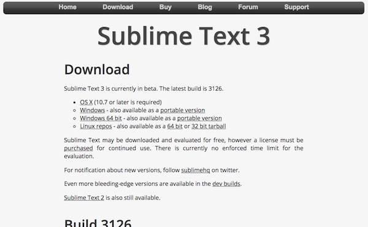
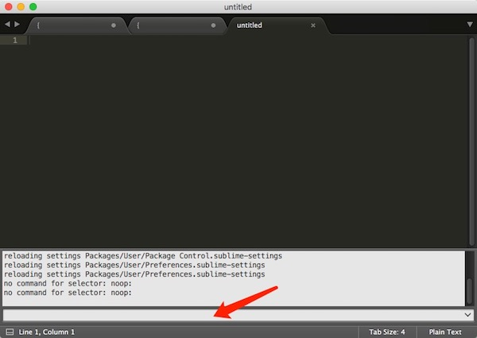
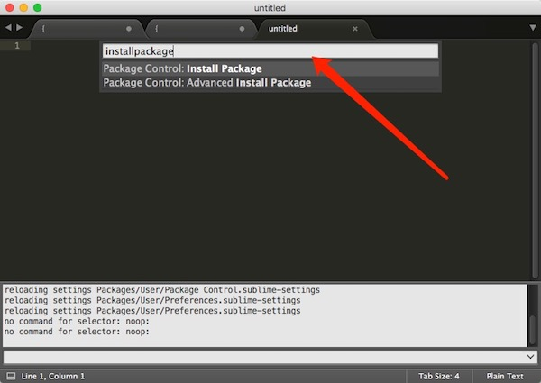

# Sublime Text的JSON插件Pretty JSON

## Sublime Text 安装

到[Sublime Text官网](http://www.sublimetext.com/3)下载，并安装

## 安装 `PackageControl`

1. 到 [这里](https://packagecontrol.io/installation) 复制代码
	

2. 打开 `Sublime -> View -> Show Console` 输入 复制的代码，并回车
	

3. 重启后 `cmd + shift +p`，输入 `Install Package` 回车
	

4. 打开窗口，搜索 `Pretty JSON` 回车，就可以使用  `Ctrl + Cmd + J` 格式化 `JSON`

---

参考的文章
1. http://blog.csdn.net/yanzi1225627/article/details/50703942