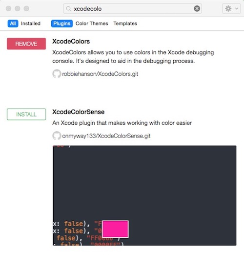

# Xcode插件

[Alcatraz](http://alcatraz.io/) 是一个能帮你管理Xcode插件、模版及颜色配置的工具。它可以直接集成在Xcode的图形界面中,让你感觉就像在使用Xcode自带的功能一样。

Alcatraz只支持 Xcode7

## 安装alcatraz

控制台运行 

```
curl -fsSL https://raw.githubusercontent.com/supermarin/Alcatraz/deploy/Scripts/install.sh | sh
```

## 使用

然后重启 Xcode ， 打开 `window ---> package manage` , 输入想要的插件， `install`



安装插件后需要重启Xcode

Xcode7重启Xcode会弹出提示框询问是否加载插件，选择`Load Bundle`加载

如果不小心点击了`Skip Bundle`。在 Mac 终端输入命令：
```
defaults delete com.apple.dt.Xcode DVTPlugInManagerNonApplePlugIns-Xcode-7.1(这里输入对应的Xcode版本号)
```

然后重启 Xcode 就会重新提示是否允许加载插件了。

---

## 我安装的Xcode插件
- VVDocumenter-Xcode  三个 / 快速添加注释
- KZLinkedConsole  异常直接跳转源代码
- XAlign  代码对齐( shift+cmd+x)
- XcodeColors  控制台颜色
- Backlight 高亮显示正在编辑的行（edit菜单中设置）
- HighlightSelectedString  选中一个 字符串 高亮显示相同的字符串（edit菜单中设置）

## 2017.05.18安装的Xcode插件
+ XToDo 按 control + t 跳出XToDo的窗口，把项目中的 TODO FIXME等注释列出来
+ AutoHighlightSymbol  选中一个 字符串 高亮显示相同的字符串
+ Translate 选中需要翻译的单词/句子，按 option+shift+t

+ XVim 针对Xcode的Vim插件
+ YouCompleteMe 在Vim中添加代码自动补全功能(OC、OC++、C++以及C)

--- 

参考的文章
1. http://alcatraz.io/