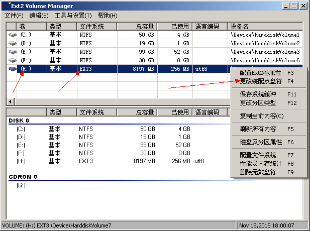
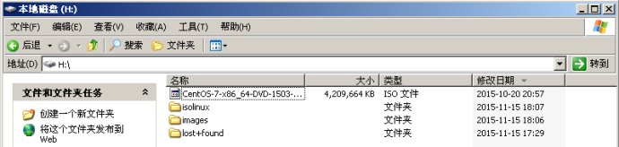
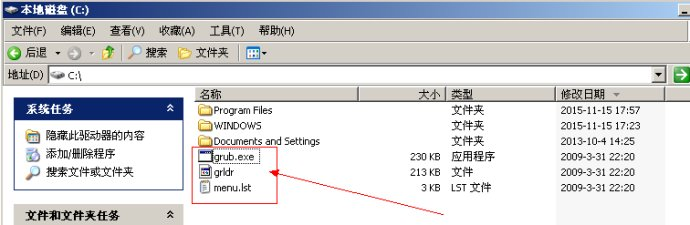
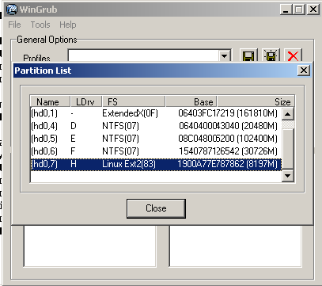
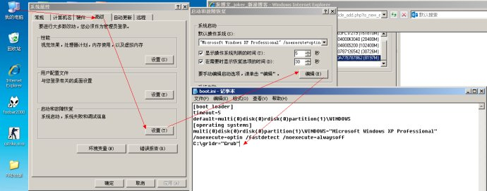

# xp + centos7 双系统安装

在 xp 基础上安装 centos7

## 准备工具

+ `分区助手`：看名字就知道哈哈
+ `grub4dos`：用于引导linux系统
+ `Ext2Fsd`：用于windows下能读写ext2或ext3分区

## 安装步骤
1. 先使用`分区助手`，分一个`ext3分区`用于存放安装文件，fat32不支持大于4g的文件
2. 使用 `Ext2fsd` 工具读写`ext3分区`
	

3. 将`CentOS.ISO`考到准备好的`磁盘（ext3）`，并将其中的`vmlinuz，initrd.img`，
`images`解压出来。例如将镜像考到`H盘`，然后将`isolinux`，`images`解压到`H盘`下面。
	

4. 使用 `grub4dos`，解压`grub`，将里面的`grldr、menu.list、grldr.exe`拷贝出来,放入到`C盘`中
	

5. 编辑 `menu.list` 文件，在最后添加
	```
	title 
	install CentOS 
	kernel (hd0,7)/isolinux/vmlinuz linux repo=hd:/dev/sda8:/ 
	initrd (hd0,7)/isolinux/initrd.img
	```
	> 这里需注意，(hdX,Y)
	> X为0表示第一块磁盘，如果电脑只有一块磁盘0就是表示这块磁盘
	> Y表示分区，扩展分区从数字4开始，即（sda5），(hd0,4)==sda5==D:,上面的命令也可以手动输入

	

6. 编辑 `boot.ini` 文件，首先需要修改属性，默认文件为只读文件，在末尾添加: `C:\grldr="Grub"`
	

	重新启动，启动时选择`Grub`，然后选择 `install CentOS` 接下来就可以安装centos7 了，安装步骤可以参考 `Oracle VM VirtualBox 安装 Centos7`

7. 安装完成后，重启电脑发现没有 Windows xp 启动项，centos可以正常启动

	首先启动centos，使用root登录 ， 修改 `/boot/grub2/grub.cfg` 文件，如下：
	```
	### BEGIN /etc/grub.d/30_os-prober ###
	menuentry 'Windows XP' {
	insmod ntfs
	set root=(hd0,1)//指向C盘中安装的XP系统
	chainloader +1
	}
	### END /etc/grub.d/30_os-prober ###
	```

	保存文件。重启电脑，成功出现 Windows XP（修改grub.cfg文件中取的名字）的启动windows的引导
