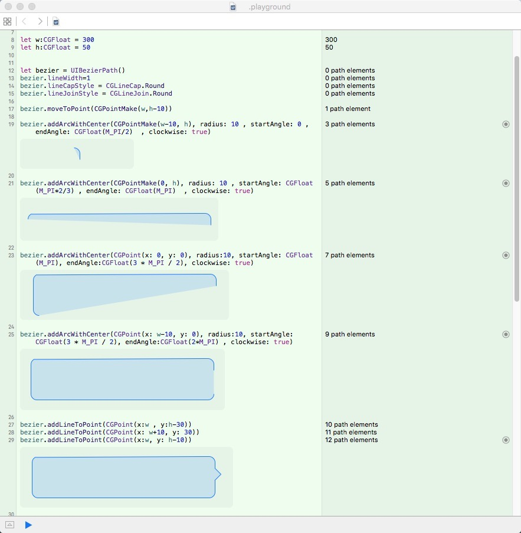
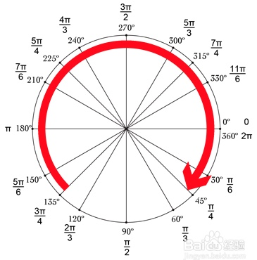

# 画图
```
let w:CGFloat = 300
let h:CGFloat = 50


let bezier = UIBezierPath()
bezier.lineWidth=1
bezier.lineCapStyle = CGLineCap.Round
bezier.lineJoinStyle = CGLineJoin.Round

bezier.moveToPoint(CGPointMake(w,h-10))

bezier.addArcWithCenter(CGPointMake(w-10, h), radius: 10 , startAngle: 0 , endAngle: CGFloat(M_PI/2)  , clockwise: true)

bezier.addArcWithCenter(CGPointMake(0, h), radius: 10 , startAngle: CGFloat(M_PI/2) , endAngle: CGFloat(M_PI)  , clockwise: true)

bezier.addArcWithCenter(CGPoint(x: 0, y: 0), radius:10, startAngle: CGFloat(M_PI), endAngle:CGFloat(3 * M_PI / 2), clockwise: true)

bezier.addArcWithCenter(CGPoint(x: w-10, y: 0), radius:10, startAngle: CGFloat(3 * M_PI / 2), endAngle:CGFloat(2*M_PI) , clockwise: true)

bezier.addLineToPoint(CGPoint(x:w , y:h-30))
bezier.addLineToPoint(CGPoint(x: w+10, y: 30))
bezier.addLineToPoint(CGPoint(x:w, y: h-10))
bezier.closePath()
```

# 使用
```
//加到CAShapeLayer，效果出来了
let shapelayer:CAShapeLayer = CAShapeLayer()
//设置边框颜色
shapelayer.strokeColor = UIColor.redColor().CGColor
//设置填充颜色
shapelayer.fillColor = UIColor.purpleColor().CGColor
//就是这句话在关联彼此（UIBezierPath和CAShapeLayer）：
shapelayer.path = bezier.CGPath;
self.myview.layer.addSublayer(shapelayer)
```
