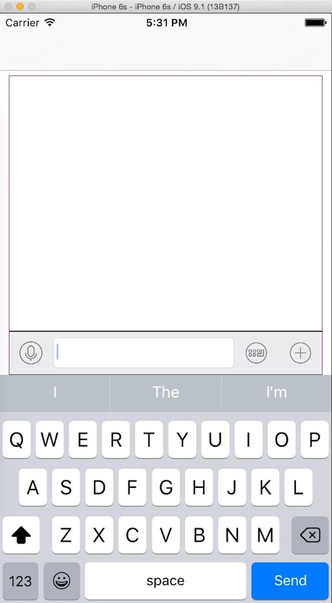

先把目前完成的整理出来，目前个人思路还比较乱，后续优化



# 思路

> 页面底部使用UIView
> UIView中包含 textview 、button 、collectionView
> 添加 NSNotificationCenter 监听键盘 移动view
> 语音button 控制 textview 及 键盘
> 其他button 控制 键盘 及 collectionView

# 使用键盘
```
// 键盘
let v:UIView = InputBar(frame: CGRectMake(0,h-50,w,50))
```

# 键盘定义
```
import UIKit

class InputBar: UIView , UITextViewDelegate {
    
    var textview:UITextView!//文本
    var voicebtn:UIButton!//话筒
    var facebtn:UIButton!//表情
    var morebtn:UIButton!//更多
    
    override init(frame: CGRect) {        
        super.init(frame: frame)
        
        let w:CGFloat =  frame.size.width
        let h:CGFloat =  frame.size.height
        
        self.backgroundColor = UIColor(red: 0.922, green: 0.925, blue: 0.929, alpha: 1)
        
        //初始化键盘组件
        var x:CGFloat = 0
        voicebtn = UIButton(frame: CGRectMake(0,0,h,h))
        voicebtn.addTarget(self, action: "voicebtnclick:", forControlEvents: UIControlEvents.TouchUpInside)
        voicebtn.setImage(UIImage(named: "chat_bottom_voice_nor"), forState: UIControlState.Normal)
        voicebtn.setImage(UIImage(named: "chat_bottom_voice_press"), forState: UIControlState.Highlighted)
        voicebtn.setImage(UIImage(named: "chat_bottom_keyboard_nor"), forState: UIControlState.Selected)
        self.addSubview(voicebtn)
        
        x += voicebtn.frame.size.width
        textview = UITextView(frame: CGRectMake(x, (h-35)/2, w-(3*h), 35))
        textview.delegate = self
        textview.layer.masksToBounds = true
        textview.layer.cornerRadius = 4
        textview.layer.borderWidth=1
        textview.layer.borderColor = UIColor.lightGrayColor().colorWithAlphaComponent(0.4).CGColor
        textview.scrollIndicatorInsets = UIEdgeInsetsMake(10, 0, 10, 4)
        textview.contentInset = UIEdgeInsetsZero
        textview.scrollEnabled = false
        textview.scrollsToTop = false
        textview.userInteractionEnabled = true
        textview.font = UIFont.systemFontOfSize(14)
        textview.textColor = UIColor.blackColor()
        textview.keyboardAppearance = UIKeyboardAppearance.Default
        textview.keyboardType = UIKeyboardType.Default
        textview.returnKeyType = UIReturnKeyType.Send
        textview.textAlignment = NSTextAlignment.Left
        self.addSubview(textview)
        
        x += textview.frame.size.width
        facebtn = UIButton(frame: CGRectMake(x,0,h,h))
        facebtn.addTarget(self, action: "facebtnclick:", forControlEvents: UIControlEvents.TouchUpInside)
        facebtn.setImage(UIImage(named: "chat_bottom_smile_nor"), forState: UIControlState.Normal)
        facebtn.setImage(UIImage(named: "chat_bottom_smile_press"), forState: UIControlState.Highlighted)
        facebtn.setImage(UIImage(named: "chat_bottom_keyboard_nor"), forState: UIControlState.Selected)
        self.addSubview(facebtn)
        
        x += facebtn.frame.size.width
        morebtn = UIButton(frame: CGRectMake(x,0,h,h))
        morebtn.addTarget(self, action: "morebtnclick:", forControlEvents: UIControlEvents.TouchUpInside)
        morebtn.setImage(UIImage(named: "chat_bottom_up_nor"), forState: UIControlState.Normal)
        morebtn.setImage(UIImage(named: "chat_bottom_up_press"), forState: UIControlState.Highlighted)
        morebtn.setImage(UIImage(named: "chat_bottom_keyboard_nor"), forState: UIControlState.Selected)
        self.addSubview(morebtn)
        
        //监听键盘显示、隐藏变化，让自己伴随键盘移动
        NSNotificationCenter.defaultCenter().addObserver(self, selector: "keyboardchange:", name: UIKeyboardWillChangeFrameNotification, object: nil)
    }
    
    required init?(coder aDecoder: NSCoder) {
        fatalError("init(coder:) has not been implemented")
    }
    
    deinit{
        NSNotificationCenter.defaultCenter().removeObserver(self)
    }
    
    func keyboardchange(sender:NSNotification){
        let userinfo:NSDictionary = sender.userInfo!
        
        let endframe:CGRect = userinfo.objectForKey(UIKeyboardFrameEndUserInfoKey)!.CGRectValue
        let duration:NSTimeInterval = userinfo.objectForKey(UIKeyboardAnimationDurationUserInfoKey) as! NSTimeInterval
        
        UIView.animateWithDuration(duration, delay: 0, options: ( UIViewAnimationOptions.BeginFromCurrentState) , animations: { () -> Void in
            
            var supframe:CGRect = self.superview!.frame
            
            var newframe:CGRect = self.frame
            // 输入框y = 键盘y - 输入框高 - navigationbar高
            newframe.origin.y = endframe.origin.y - self.bounds.size.height - supframe.origin.y
            self.frame = newframe
            
            supframe.size.height = endframe.origin.y
            
            }) { (bol) -> Void in
        }
    }
    func voicebtnclick(sender:AnyObject?){
        textview.resignFirstResponder()
        let btn = sender as! UIButton
        btn.selected = !btn.selected
        if btn.selected == false{
            textview.becomeFirstResponder()
        }else{
            facebtn.selected = false
            morebtn.selected = false
        }
    }
    func facebtnclick(sender:AnyObject?){
        textview.resignFirstResponder()
        let btn = sender as! UIButton
        btn.selected = !btn.selected
        if btn.selected == false{
            textview.becomeFirstResponder()
        }else{
            voicebtn.selected = false
            morebtn.selected = false
        }
    }
    func morebtnclick(sender:AnyObject?){
        textview.resignFirstResponder()
        let btn = sender as! UIButton
        btn.selected = !btn.selected
        if btn.selected == false{
            textview.becomeFirstResponder()
        }else{
            facebtn.selected = false
            voicebtn.selected = false
        }
    }
}
```
