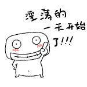

---
title: "Hexo-NexT 主题使用总结"
date: 2017-06-16 16:58:55
categories:
 - Web
tags:
 - Hexo
 - NexT
description: "精于心，简于形 Elegant Theme for Hexo"
copyright: true
---

# 使用 Hexo - NexT 主题

假定你已经成功安装了 Hexo，并使用 Hexo 提供的命令创建了一个站点。

在 Hexo 中有两份主要的配置文件，其名称都是 _config.yml。
+ 一份位于站点根目录下，主要包含 Hexo 本身的配置
+ 另一份位于主题目录下，这份配置由主题作者提供，主要用于配置主题相关的选项。

## 安装 NexT

将主题文件拷贝至站点目录的 themes 目录下， 然后修改下配置文件即可

1. 下载主题

	定位到Hexo目录下 `git clone https://github.com/iissnan/hexo-theme-next themes/next`

2. 使用主题

	修改站点根目录下 `_config.yml` 文件中的 `theme: next`

3. 验证主题

	启动 Hexo 本地站点，并开启调试模式（即加上 --debug）整个命令是 `hexo s --debug` 此时即可使用浏览器访问 `http://localhost:4000` 检查站点是否正确运行。	

## 主题设定

1. 外观

	修改主题目录下 `_config.yml` 文件中的 `scheme: Mist`
	Scheme 是 NexT 提供的一种特性，借助于 Scheme，NexT 为你提供多种不同的外观

	+ Muse - 默认 Scheme，这是 NexT 最初的版本，黑白主调，大量留白
	+ Mist - Muse 的紧凑版本，整洁有序的单栏外观
	+ Pisces - 双栏 Scheme，小家碧玉似的清新

2. 语言

	修改站点根目录下 `_config.yml` 文件中的 `language: zh-Hans`

	+ English	language: en
	+ 简体中文	language: zh-Hans

3. 菜单
	
	NexT 使用的是 Font Awesome 提供的图标

	+ 菜单项（key和链接) 修改主题目录下 `_config.yml` 文件中的 `menu: key:link` 其中 `key`  是一个名称，这个名称并不直接显示在页面上，她将用于匹配图标以及翻译。
	+ 菜单项的显示文本 `key` 翻译文本放置在 NexT 主题目录下的 `languages/你所使用的语言.yml`
	+ 菜单项对应的图标 修改主题目录下 `_config.yml` 文件中的 `menu_icons: ...`

4. 侧栏
	
	默认情况下，侧栏仅在文章页面（拥有目录列表）时才显示，并放置于右侧位置。
	
	+ 修改主题目录下 `_config.yml` 文件中的 `sidebar.position: left/right` 改变侧栏的位置
	+ 修改主题目录下 `_config.yml` 文件中的 `sidebar.display: always` 改变侧栏显示的时机

		+ post - 默认行为，在文章页面（拥有目录列表）时显示
		+ always - 在所有页面中都显示
		+ hide - 在所有页面中都隐藏（可以手动展开）
		+ remove - 完全移除

5. 头像

	修改主题目录下 `_config.yml` 文件中的 `avatar` 设置成头像的链接地址

	+ 放置在 `source/images/` 目录下 配置为：`avatar: /images/avatar.png`
	+ 完整的互联网 URI 配置为：`avatar: http://example.com/avatar.png`

6. 其他

	+ 修改站点根目录下 `_config.yml` 文件中的 `author` 设置昵称
	+ 修改站点根目录下 `_config.yml` 文件中的 `description` 你喜欢的一句签名作为站点描述
	+ 设置「动画效果」 修改主题目录下 `_config.yml` 文件中的 `use_motion: true/false`
	+ NexT 自带两种背景动画效果 修改主题目录下 `_config.yml` 文件中的  `canvas_nest` 或者 `three_waves` 

	侧边栏社交链接

	+ 链接 修改主题目录下 `_config.yml` 文件中的 `social: 显示文本: 链接地址` 
	+ 链接的图标 修改主题目录下 `_config.yml` 文件中的 `social_icons: 显示文本: Font Awesome 图标名称` 

	开启打赏功能 修改站点根目录下 `_config.yml` 中填入 微信 和 支付宝 收款二维码图片地址

	```
	reward_comment: 坚持原创技术分享，您的支持将鼓励我继续创作！
	wechatpay: /path/to/wechat-reward-image
	alipay: /path/to/alipay-reward-image	
	```

## 第三方服务集成

	评论、搜索、统计、分享


## 主菜单配置

修改主题目录下 `_config.yml` 文件中的 `menu` 

```
# When running the site in a subdirectory (e.g. domain.tld/blog), remove the leading slash (/archives -> archives)
menu:
  home: /
  archives: /archives/
  categories: /categories/
  tags: /tags/
  about: /about/
  # sitemap: /sitemap.xml
  # commonweal: /404.html
```

### 添加标签页面

1. 新建页面

	执行命令：

	```
	cd myBlog
	hexo new page tags
	```

	输入命令后，在myBlog/source下会新生成一个新的文件夹tags，在该文件夹下会有一个index.md文件。
2. 设置页面类型

	在myBlog/source/tags/index.md中添加type: "tags"

3. 设置文章的tags

	当要为某一篇文章添加标签，只需在myBlog/source/_post目录下的具体文章的tags中添加标签即可 

	```
	---
	title: 使用 Hexo - NexT 主题
	date: 2017-06-16 16:58:55
	categories: 
		- Hexo
	tags:  [Hexo, 其他]
	description: "使用 Hexo - NexT 主题" #你對本頁的描述 可以省略
	---
	```

### 添加分类页面

1. 新建页面

	执行命令：

	```
	cd myBlog
	hexo new page categories
	```

	输入命令后，在myBlog/source下会新生成一个新的文件夹categories，在该文件夹下会有一个index.md文件。

2. 设置页面类型

	在myBlog/source/categories/index.md中添加type: "categories"

3. 设置文章的 categories

	当要为某一篇文章添加分类，只需在myBlog/source/_post目录下的具体文章的categories中添加分类即可

	```
	---
	title: 使用 Hexo - NexT 主题
	date: 2017-06-16 16:58:55
	categories: 
		- Hexo
	tags:  [Hexo, 其他]
	description: "使用 Hexo - NexT 主题" #你對本頁的描述 可以省略
	---
	```

### 添加关于我页面

1. 新建页面

	```
	cd myBlog
	hexo new page about
	```

	输入命令后，在myBlog/source下会新生成一个新的文件夹about，在该文件夹下会有一个index.md文件。

2. 修改about/index.md

	```
	---
	title: about
	date: 2016-11-15 19:08:50
	---
	## 关于我

	```

### 添加站内搜索(我失败了)

NexT主题支持集成 Swiftype、 微搜索、Local Search 和 Algolia,Swiftype和Algolia都只有一段时间的试用期，可以采用Hexo提供的Local Search,原理是通过hexo-generator-search插件在本地生成一个search.xml文件，搜索的时候从这个文件中根据关键字检索出相应的链接。

1. 安装 hexo-generator-search

	在myBlog执行：`npm install hexo-generator-search --save`

2. 安装 hexo-generator-searchdb

	在myBlog执行：`npm install hexo-generator-searchdb --save`

3. 启用搜索
	
	修改站点根目录下 `_config.yml` 文件，增加 `search`

	```
	search:
		  path: search.xml
		  field: post
		  format: html
		  limit: 10000
	```

### 添加站内搜索(成功)

修改主题目录下 `_config.yml` 文件中的 `local_search`

```
# Local search
local_search:
  enable: true
  # if auto, trigger search by changing input
  # if manual, trigger search by pressing enter key or search button
  trigger: auto
  # show top n results per article, show all results by setting to -1
  top_n_per_article: 1
```

## 文章添加图片

使用[CodeFalling hexo-asset-image](https://github.com/CodeFalling/hexo-asset-image)

1. 修改站点根目录下 `_config.yml` 文件中的 `post_asset_folder:true`
2. 在站点根目录执行：`npm install https://github.com/CodeFalling/hexo-asset-image --save`
3. 使用

	

	```
	2017-06-16-Hexo主题-NexT-使用总结
	├── other.jpg
	└── image.png
	2017-06-16-Hexo主题-NexT-使用总结.md
	```

	这样的目录结构（目录名和文章名一致），只要使用 `` 就可以插入图片。

	生成的结构为

	```
	public/2017/06/16/Hexo主题-NexT-使用总结
	├── index.html
	├── other.jpg
	└── image.png
	```

	同时，生成的 html 是

	``

# 基于源码修改

## 文章内链接文本样式

修改 `themes\next\source\css\_common\components\post\post.styl` 在末尾添加css样式

```
// 文章内链接文本样式
// .post-body 是为了不影响标题
// p 是为了不影响首页“阅读全文”的显示样式
.post-body p a{
  color: #0593d3;
  border-bottom: none;
  border-bottom: 1px solid #0593d3;
  &:hover {
    color: #fc6423;
    border-bottom: none;
    border-bottom: 1px solid #fc6423;
  }
}
```

## 代码块样式

修改 `themes\next\source\css\_custom\custom.styl` 添加css样式
```
code {
    color: #ff7600;
    background: #fbf7f8;
    margin: 2px;
}
// 大代码块的自定义样式
.highlight, pre {
    margin: 5px 0;
    padding: 5px;
    border-radius: 3px;
}
.highlight, code, pre {
    border: 1px solid #d6d6d6;
}
```

## 文章底部的带\#号的标签改为字体图标

修改 `themes/next/layout/_macro/post.swig` 搜索 `rel="tag">#` ，将 `#` 换成 `<i class="fa fa-tag"></i>`

## 删除底部页脚 `由 Hexo 强力驱动  主题 - NexT.Mist`
修改 `themes/next/layout/_partials/footer.swig` 删除 `<div class="powered-by">` 和 `<div class="theme-info">`

## 作者头像旋转
修改`themes\next\source\css\_common\components\sidebar\sidebar-author.styl` 并添加
```
.site-author-image {
  display: block;
  margin: 0 auto;
  padding: $site-author-image-padding;
  max-width: $site-author-image-width;
  height: $site-author-image-height;
  border: $site-author-image-border-width solid $site-author-image-border-color;

  /* 头像圆形 */
  border-radius: 80px;
  -webkit-border-radius: 80px;
  -moz-border-radius: 80px;
  box-shadow: inset 0 -1px 0 #333sf;

  /* 设置循环动画 [animation: (play)动画名称 (2s)动画播放时长单位秒或微秒 (ase-out)动画播放的速度曲线为以低速结束 
    (1s)等待1秒然后开始动画 (1)动画播放次数(infinite为循环播放) ]*/
 

  /* 鼠标经过头像旋转360度 */
  -webkit-transition: -webkit-transform 1.0s ease-out;
  -moz-transition: -moz-transform 1.0s ease-out;
  transition: transform 1.0s ease-out;
}

img:hover {
  /* 鼠标经过停止头像旋转 
  -webkit-animation-play-state:paused;
  animation-play-state:paused;*/

  /* 鼠标经过头像旋转360度 */
  -webkit-transform: rotateZ(360deg);
  -moz-transform: rotateZ(360deg);
  transform: rotateZ(360deg);
}

/* Z 轴旋转动画 */
@-webkit-keyframes play {
  0% {
    -webkit-transform: rotateZ(0deg);
  }
  100% {
    -webkit-transform: rotateZ(-360deg);
  }
}
@-moz-keyframes play {
  0% {
    -moz-transform: rotateZ(0deg);
  }
  100% {
    -moz-transform: rotateZ(-360deg);
  }
}
@keyframes play {
  0% {
    transform: rotateZ(0deg);
  }
  100% {
    transform: rotateZ(-360deg);
  }
}
```

## 网站底部加上访问量
修改 `themes\next\layout_partials\footer.swig` 添加
```
<script async src="https://dn-lbstatics.qbox.me/busuanzi/2.3/busuanzi.pure.mini.js"></script>

<div class="powered-by">
<i class="fa fa-user-md"></i><span id="busuanzi_container_site_uv">
  本站访客数:<span id="busuanzi_value_site_uv"></span>
</span>
</div>
```

1. pv的方式，单个用户连续点击n篇文章，记录n次访问量
	```
	<span id="busuanzi_container_site_pv">
	    本站总访问量<span id="busuanzi_value_site_pv"></span>次
	</span>
	```
2. uv的方式，单个用户连续点击n篇文章，只记录1次访客数
	```
	<span id="busuanzi_container_site_uv">
	  本站总访问量<span id="busuanzi_value_site_uv"></span>次
	</span>
	```

## 首页文章区域添加阴影

在 `themes/next/source/css/_custom/custom.styl` 中，添加
```
 .post {
   margin-top: 60px;
   margin-bottom: 60px;
   padding: 25px;
   -webkit-box-shadow: 0 0 5px rgba(202, 203, 203, .5);
   -moz-box-shadow: 0 0 5px rgba(202, 203, 204, .5);
  }
```

## 添加顶部加载条

### head.swig

修改 `themes/next/layout/_partials/head.swig` 添加
```
<script src="//cdn.bootcss.com/pace/1.0.2/pace.min.js"></script>
<link href="//cdn.bootcss.com/pace/1.0.2/themes/pink/pace-theme-flash.css" rel="stylesheet">

<style>
    .pace .pace-progress {
        background: #1E92FB; /*进度条颜色*/
        height: 3px;
    }
    .pace .pace-progress-inner {
         box-shadow: 0 0 10px #1E92FB, 0 0 5px     #1E92FB; /*阴影颜色*/
    }
    .pace .pace-activity {
        border-top-color: #1E92FB;    /*上边框颜色*/
        border-left-color: #1E92FB;    /*左边框颜色*/
    }
</style>
```
### _config.yml

修改 主题目录下 `_config.yml` 文件中 `pace: true`

## 设置favicon

根据主题目录下 `_config.yml` 文件中 `favicon` 的说明，添加 `favicon.ico`
```
# Put your favicon.ico into `hexo-site/source/` directory.
favicon: /favicon.ico
```

## 在文章底部增加文章结束
1. 在目录 `themes/next/layout/_macro/` 下添加 `passage-end-tag.swig`
  ```
  <div>
      
          <div style="text-align:center;color: #ccc;font-size:14px;">-------------本文结束<i class="fa fa-paw"></i>感谢您的阅读-------------</div>
      
  </div>
  ```

2. 在文件 `themes/next/layout/_macro/post.swig` 中的 `post-body` 之后，`post-footer` 之前的
  ```
  <div>
        
          
        
  </div>
  ```
  的前面添加
  ```
  <div>
    
      
    
  </div>
  ```

3. 在主题目录下 `_config.yml` 文件中的添加
  ```
  # 文章末尾添加“本文结束”标记
  passage_end_tag:
    enabled: true
  ```

## 在文章底部增加版权信息
在目录 `themes/next/layout/_macro/` 下添加 `my-copyright.swig`
```

<div class="my_post_copyright">
  <script src="//cdn.bootcss.com/clipboard.js/1.5.10/clipboard.min.js"></script>
  
  <!-- JS库 sweetalert 可修改路径 -->
  <script type="text/javascript" src="http://jslibs.wuxubj.cn/sweetalert_mini/jquery-1.7.1.min.js"></script>
  <script src="http://jslibs.wuxubj.cn/sweetalert_mini/sweetalert.min.js"></script>
  <link rel="stylesheet" type="text/css" href="http://jslibs.wuxubj.cn/sweetalert_mini/sweetalert.mini.css">
  <p><span>本文标题:</span><a href="{{ url_for(page.path) }}">{{ page.title }}</a></p>
  <p><span>文章作者:</span><a href="/" title="访问 {{ theme.author }} 的个人博客">{{ theme.author }}</a></p>
  <p><span>发布时间:</span>{{ page.date.format("YYYY年MM月DD日 - HH:MM") }}</p>
  <p><span>最后更新:</span>{{ page.updated.format("YYYY年MM月DD日 - HH:MM") }}</p>
  <p><span>原始链接:</span><a href="{{ url_for(page.path) }}" title="{{ page.title }}">{{ page.permalink }}</a>
    <span class="copy-path"  title="点击复制文章链接"><i class="fa fa-clipboard" data-clipboard-text="{{ page.permalink }}"  aria-label="复制成功！"></i></span>
  </p>
  <p><span>许可协议:</span><i class="fa fa-creative-commons"></i> <a rel="license" href="https://creativecommons.org/licenses/by-nc-nd/4.0/" target="_blank" title="Attribution-NonCommercial-NoDerivatives 4.0 International (CC BY-NC-ND 4.0)">署名-非商业性使用-禁止演绎 4.0 国际</a> 转载请保留原文链接及作者。</p>  
</div>
<script> 
    var clipboard = new Clipboard('.fa-clipboard');
    clipboard.on('success', $(function(){
      $(".fa-clipboard").click(function(){
        swal({   
          title: "",   
          text: '复制成功',   
          html: false,
          timer: 500,   
          showConfirmButton: false
        });
      });
    }));  
</script>

```

在目录 `themes/next/source/css/_common/components/post/` 下添加 `my-post-copyright.styl`
```
.my_post_copyright {
  width: 85%;
  max-width: 45em;
  margin: 2.8em auto 0;
  padding: 0.5em 1.0em;
  border: 1px solid #d3d3d3;
  font-size: 0.93rem;
  line-height: 1.6em;
  word-break: break-all;
  background: rgba(255,255,255,0.4);
}
.my_post_copyright p{margin:0;}
.my_post_copyright span {
  display: inline-block;
  width: 5.2em;
  color: #b5b5b5;
  font-weight: bold;
}
.my_post_copyright .raw {
  margin-left: 1em;
  width: 5em;
}
.my_post_copyright a {
  color: #808080;
  border-bottom:0;
}
.my_post_copyright a:hover {
  color: #a3d2a3;
  text-decoration: underline;
}
.my_post_copyright:hover .fa-clipboard {
  color: #000;
}
.my_post_copyright .post-url:hover {
  font-weight: normal;
}
.my_post_copyright .copy-path {
  margin-left: 1em;
  width: 1em;
  +mobile(){display:none;}
}
.my_post_copyright .copy-path:hover {
  color: #808080;
  cursor: pointer;
}
```

修改 `themes/next/layout/_macro/post.swig`
在
```
<div>
      
        
      
</div>
```
之前添加
```
<div>
      
        
      
</div>
```

修改 ·`themes/next/source/css/_common/components/post/post.styl`添加
`@import "my-post-copyright"`

在博客信息中添加 `copyright: true`

```
---
title: "Hexo-NexT 主题使用总结"
date: 2017-06-16 16:58:55
categories:
	- 运维
tags:
	- Hexo
description: "精于心，简于形 Elegant Theme for Hexo"
copyright: true
---
```

### 优化 原始链接

如果解析出来之后，你的原始链接有问题
修改站点根目录 `_config.yml` 文件
```
url: https://
```

### 优化 post.md 模板
如果你觉得每次都要输入 `copyright: true` 很麻烦的话,那么在 `站点根目录/scaffolds/post.md` 文件中添加：`copyright`
```
---
title: {{ title }}
date: {{ date }}
categories:
tags:
copyright:
---
```
这样每次 `hexo new 'XXX'` 后生成的md文件会自动把 `copyright:` 加到里面去

---

参考的文章
1. https://segmentfault.com/a/1190000009544924?utm_source=tuicool&utm_medium=referral
2. http://shenzekun.cn/hexo%E7%9A%84next%E4%B8%BB%E9%A2%98%E4%B8%AA%E6%80%A7%E5%8C%96%E9%85%8D%E7%BD%AE%E6%95%99%E7%A8%8B.html
3. http://www.tuicool.com/articles/umEBVfI
4. http://theme-next.iissnan.com/