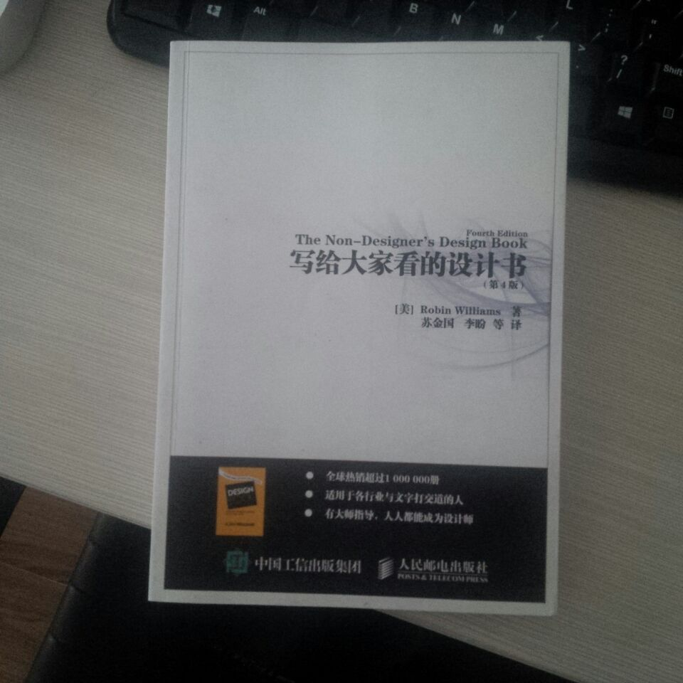

# 写给大家看的设计书

Fourth Edition The Non-Designer's Design Book —— Robin Williams

前段时间读了这本书，过了一段时间忘记了，这段时间又读了一遍，顺便做了这份笔记

## 设计的基本原则

### 对比

页面上的不同元素之间要有对比效果，达到吸引读者的对比效果
避免元素太过相似，不同元素之间要有对比效果，让它们截然不同
不要害怕让一些项很小，这样不仅可以与更大的项形成对比，还能留出更多的空白。一旦读者把握重点，只要他们感兴趣，自然会去读这些较小的文字。如果他们不感兴趣，不论你把这些文字设置得多大他们也不会去读

### 重复

设计的某些方面需要在整个作品中重复
重复的目的就是统一，增强视觉效果
避免重复一个元素

### 对齐

只使用一种对齐方式

如果设计中的对齐很明确，那么可以有意识的打破对齐，而且一定要表现出这是有意的。打破常规对齐时不要怯懦，一定到干脆，不要保守

只有你是有意为之，有时可以完全任意打破常规对齐

打破规则之前，必须清楚规则是什么

### 亲密性

将相关的项组织在一起

### 基本原则复习

有关设计（同时也是有关生活）的一个更一般的指导原则：不要畏畏缩缩

+ 不要害怕在设计中留有空白，这能让你的眼睛稍作休息
+ 不要害怕设计是不对称的，使用非居中格式，不居中往往能使效果更强烈
+ 不要害怕把单词设置的非常大或非常小，不要担心说话的声音太大或者太小，在合适的场合这都是可以的
+ 只要最后的结果能支持或强调你的设计或者观点，不要害怕让图片太大或太小

## 颜色运用

三原色： 红、黄、蓝。
第三色： 其他颜色
互补色： 完全对立的颜色，由于他们如此对立，所以最佳搭配是一种作为主色，另一种用于强调
三色组： 彼此等距的三种颜色（如：红、黄、蓝）
基色三色组： 红、黄、蓝
间色三色组： 绿、橙、紫
类似色： 彼此相邻的颜色
色调： 纯色
暗色： 向色调增加黑色
亮色： 向色调增加白色
单色组合： 由一种色调及其他相应的多种亮色和暗色组成
暖色： 红、黄，暖色是趋近型的，如果要组合冷色和暖色，一定要少用些暖色，不要让冷暖色太过均衡
冷色： 蓝，冷色趋于做背景色

CMYK： Cyan（一种蓝色） Magenta（一种红色） Yellow（黄色） Key（黑色） 用于印刷
RGB： 红绿蓝 用于 屏幕显示

## 字体对比

大小
粗细
结构（字体类别）
形状（大小写对比）
方向
颜色