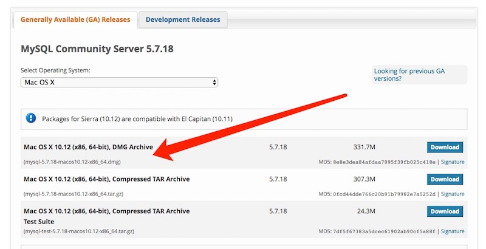
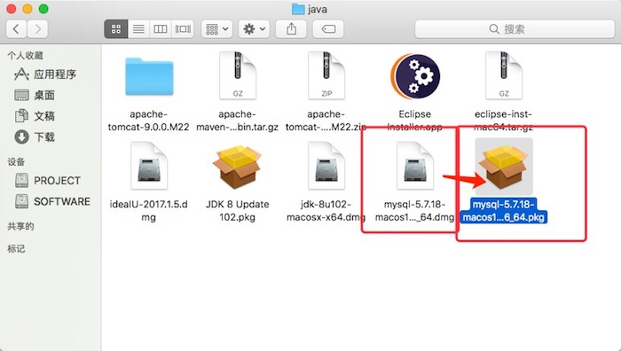
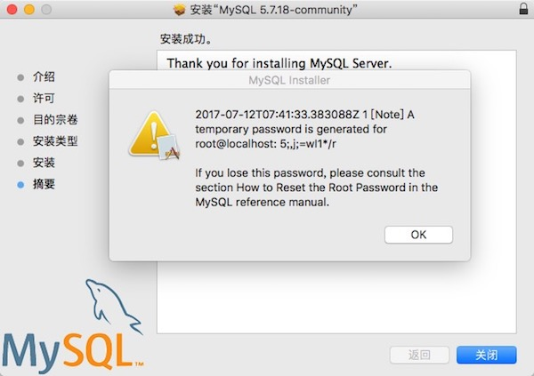
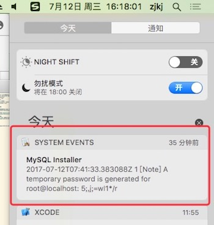
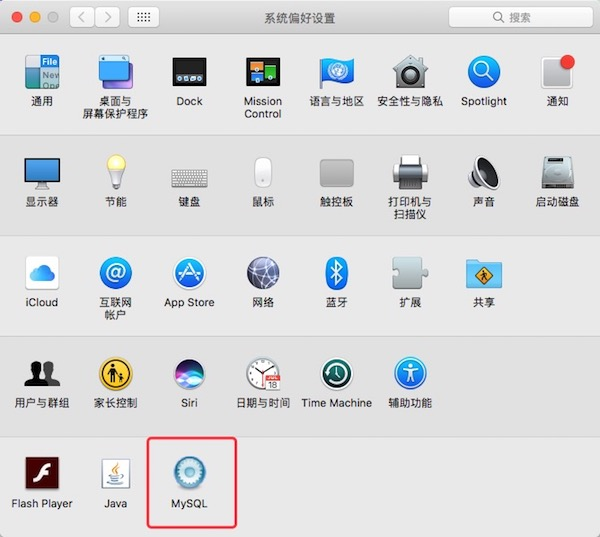
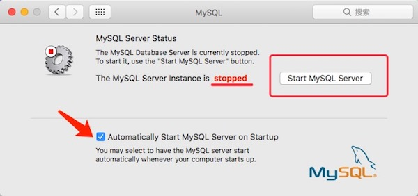
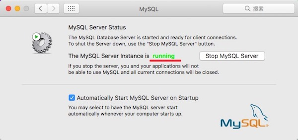

# 准备

1. 到官网下载 [MySQL Community Server 5.7.18](https://dev.mysql.com/downloads/mysql/)
 

2. 下载 `mysql-5.7.18-macos10.12-x86_64.dmg` 完成后，打开得到 `mysql-5.7.18-macos10.12-x86_64.pkg`
 

# 安装
运行 `pkg` 傻瓜式 next next 安装，安装完成后提示默认密码，如果不小心点了 `OK` 没有及时保存密码，可以打开通知查看

# 启动

### 方式一

打开 `系统偏好设置` --> `MySql` --> `Start MySQL Server`

### 方式二

终端执行 `mysql.server start` 启动

# 配置
打开 `终端` 运行 `mysql --version` 提示 `-bash: mysql: command not found` 尴尬

## 将mysql加入系统环境变量
+ 打开 `终端` 运行 `vim ~/.bash_profile`
+ 编辑文件，加入 `PATH=$PATH:/usr/local/mysql/bin` 保存
+ 执行 `source ~/.bash_profile`

运行 `mysql --version` 提示 `mysql  Ver 14.14 Distrib 5.7.18, for macos10.12 (x86_64) using  EditLine wrapper`

## 修改密码
使用 `mysql -uroot -p` 登录 `MySql`
> 我的密码 5;,j;=wI1*/r `w`后面居然是`I`，试了好多次（`1` `l` `I`）#_#

修改密码 `set password for 'root'@'localhost' = password('123456');`

接下来就可以使用你的客户端访问了