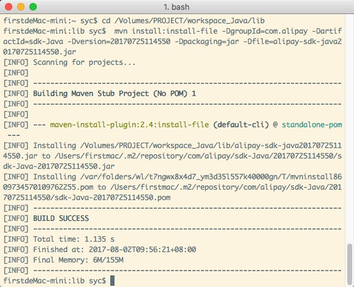

---
title: App支付服务端
date: 2017-08-02 10:38:55
categories:
	- Java
tags:
	- Maven
	- 支付
    - 支付宝
    - 微信
description: "手机App 支付宝、微信 支付服务端开发"
copyright: true
---

开发环境 MAC + IDEA + Maven + Tomcat

# Maven配置

Maven是一个项目管理和综合工具。Maven提供了开发人员构建一个完整的生命周期框架。开发团队可以自动完成项目的基础工具建设，Maven使用标准的目录结构和默认构建生命周期。

在多个开发团队环境时，Maven可以设置按标准在非常短的时间里完成配置工作。由于大部分项目的设置都很简单，并且可重复使用，Maven让开发人员的工作更轻松，同时创建报表，检查，构建和测试自动化设置。

## 下载

到 [官网http://maven.apache.org/download.cgi](http://maven.apache.org/download.cgi) 下载

## 安装

```
// 检查Java环境
echo $JAVA_HOME

// 如果没有，则设置
vi ~/.bash_profile

// 编辑保存文件
export JAVA_HOME=/.../jdk/Contents/Home
// 将maven地址添加到 PATH
export PATH=/opt/apache-maven-3.5.0/bin:$PATH

// 使修改生效
source ~/.bash_profile

// 查看Maven是否安装成功
mvn -v
```

```
firstdeMac-mini:~ syc$ mvn -v
Apache Maven 3.5.0 (ff8f5e7444045639af65f6095c62210b5713f426; 2017-04-04T03:39:06+08:00)
Maven home: /Volumes/SOFTWARE/java/apache-maven-3.5.0
Java version: 1.8.0_102, vendor: Oracle Corporation
Java home: /Library/Java/JavaVirtualMachines/jdk1.8.0_102.jdk/Contents/Home/jre
Default locale: zh_CN, platform encoding: UTF-8
OS name: "mac os x", version: "10.12.6", arch: "x86_64", family: "mac"
firstdeMac-mini:~ syc$
```

# 支付宝

## 下载SDK并导入jar

在 [支付宝官网](https://docs.open.alipay.com/54/106370) 下载SDK
`alipay-sdk-JAVA-20170725114609.zip` 解压得到 `alipay-sdk-java20170725114550.jar`

```
cd jar所在路径
mvn install:install-file -DgroupId=com.alipay -DartifactId=sdk-Java -Dversion=20170725114550 -Dpackaging=jar -Dfile=alipay-sdk-java20170725114550.jar
```




`pom.xml` 加入
```
<!-- 支付宝官方SDK -->
<dependency>
	<groupId>com.alipay</groupId>
	<artifactId>sdk-java</artifactId>
	<version>20170725114550</version>
</dependency>
```

## 支付

### 生成APP支付订单信息

```
// 订单参数，及配置
Map<String, String> params = convertAttributes(parameterMap);

//实例化客户端
String APP_ID = "";
String APP_PRIVATE_KEY = "";
String CHARSET = "";
String ALIPAY_PUBLIC_KEY = "";
//实例化客户端
AlipayClient alipayClient = new DefaultAlipayClient("https://openapi.alipay.com/gateway.do", APP_ID, APP_PRIVATE_KEY, "json", CHARSET, ALIPAY_PUBLIC_KEY, "RSA2");

//实例化具体API对应的request类,类名称和接口名称对应,当前调用接口名称：alipay.trade.app.pay
AlipayTradeAppPayRequest request = new AlipayTradeAppPayRequest();

//SDK已经封装掉了公共参数，这里只需要传入业务参数。以下方法为sdk的model入参方式(model和biz_content同时存在的情况下取biz_content)。
AlipayTradeAppPayModel model = new AlipayTradeAppPayModel();
model.setBody(params.get("body"));
model.setSubject(params.get("subject"));
model.setOutTradeNo(params.get("out_trade_no"));
model.setTimeoutExpress("30m");
model.setTotalAmount(params.get("total_fee"));
model.setProductCode("QUICK_MSECURITY_PAY");
request.setBizModel(model);
request.setNotifyUrl(params.get("notify_url"));
try {
    //这里和普通的接口调用不同，使用的是sdkExecute
    AlipayTradeAppPayResponse response = alipayClient.sdkExecute(request);

    String bodyStr = response.getBody();

    renderJson(new DatumResponse(bodyStr));    

} catch (AlipayApiException e) {
    e.printStackTrace();
    renderFailed("服务器错误!");
}
```

### IOS客户端获取到bodyStr后

```
// 使用 应用注册scheme,在*-Info.plist定义URL types
let appScheme = CodeUtil.sharedInstance.zhifubao_URLType_URLSchemes

// 调用支付结果开始支付
AlipaySDK.defaultService().payOrder(orderStr, fromScheme: appScheme, callback: { resultDic in
       
    var status = 0
    if let str = resultDic?["resultStatus"] as? String,
        let num = Int(str){
        status = num
    }
    //在resultStatus=9000，并且success=“true”以及sign=“xxx”校验通过的情况下，证明支付成功
    if status == 9000 {
        // 支付成功
        HUDUtil.showSuccess(msg: "订单支付成功")
        // do something ...
    }else{
        // 支付失败
        let errDict: [Int: String] = [
            9000: "订单支付成功",
            8000: "正在处理中",
            4000: "订单支付失败",
            5000: "重复请求",
            6001: "用户中途取消",
            6002: "网络连接出错",
            6004: "正在处理中"
        ]
        var msg = "其它支付错误"
        if let v = errDict[status]{
            msg = v
        }
        HUDUtil.showError(msg: msg)
    }
})
```
## 支付通知

```
//获取支付宝POST过来反馈信息
Map<String,String > params = new HashMap <String,String>();
Map requestParams = request.getParameterMap();

for (Iterator iter = requestParams.keySet().iterator(); iter.hasNext();) {
    String name = (String) iter.next();
    String[] values = (String[]) requestParams.get(name);
    String valueStr = "";
    for (int i = 0; i < values.length; i++) {
        valueStr = (i == values.length - 1) ? valueStr + values[i] : valueStr + values[i] + ",";
    }
    //乱码解决，这段代码在出现乱码时使用。
    valueStr = new String(valueStr.getBytes("ISO-8859-1"), "utf-8");
    params.put(name, valueStr);
}
//切记alipaypublickey是支付宝的公钥，请去open.alipay.com对应应用下查看。
//boolean AlipaySignature.rsaCheckV1(Map<String, String> params, String publicKey, String charset, String sign_type)

String alipaypublicKey = "";
try {
    boolean flag = AlipaySignature.rsaCheckV1(params, alipaypublicKey, charset, "RSA2");
    if(flag){
        /*
        WAIT_BUYER_PAY  交易创建，等待买家付款
        TRADE_CLOSED    未付款交易超时关闭，或支付完成后全额退款
        TRADE_SUCCESS   交易支付成功
        TRADE_FINISHED  交易结束，不可退款
        */
        if("TRADE_SUCCESS".equals(params.get("trade_status"))){
            //付款金额
            String amount = params.get("buyer_pay_amount");
            // 商家在交易中实际收到的款项，单位为元
            String receipt_amount = paramsMap.get("receipt_amount");
            //商户订单号
            String out_trade_no = params.get("out_trade_no");
            //支付宝交易号
            String trade_no = params.get("trade_no");
            //附加数据
            //String passback_params = URLDecoder.decode(params.get("passback_params"));

            // do something ...

            renderText("success");
            return
        }
    }
}catch (AlipayApiException ex){
    ex.printStackTrace();
}
renderText("failure");
```

# 微信

参考官方文档 https://pay.weixin.qq.com/wiki/doc/api/app/app.php?chapter=9_1