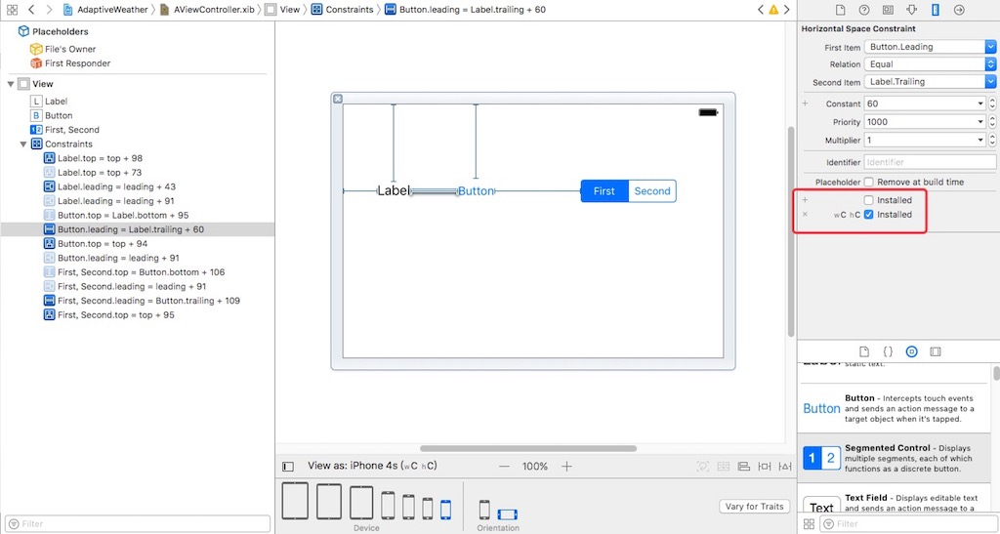

# 屏幕旋转
详情参看我的 [IOSadaptation](https://github.com/doingself/IOSadaptation)

## 方向

### 设备方向 UIDeviceOrientation

UIDeviceOrientation是硬件设备(iPhone、iPad等)本身的当前旋转方向, 以home键的位置作为参照
设备方向只能取值, 不能设置

```
// 添加通知
NotificationCenter.default.addObserver(self, selector: #selector(self.deviceChange()), name: NSNotification.Name.UIDeviceOrientationDidChange, object: nil)
UIDevice.current.beginGeneratingDeviceOrientationNotifications()

func deviceChange(){
	// 获取屏幕方向
	let tation: UIDeviceOrientation = UIDevice.current.orientation
    print(tation)
}
```

### 页面方向 UIInterfaceOrientation

程序界面的当前旋转方向, 可以设置

```
UIInterfaceOrientationLandscapeLeft = UIDeviceOrientationLandscapeRight
UIInterfaceOrientationLandscapeRight = UIDeviceOrientationLandscapeLeft
```

### 页面方向：UIInterfaceOrientationMask

UIInterfaceOrientationMask是iOS6之后增加的一种枚举

## 屏幕旋转

### 方式一

控制中心不锁定屏幕方向

如下 1 和 2 效果一样

1. 设置 Target --> General --> Deployment Info --> Device Orientation 勾选 landscape 和 protrait 3个
2. App的全局屏幕旋转设置, 屏幕旋转时触发
```
var allowLandscape = false
extension AppDelegate{    
    func application(_ application: UIApplication, supportedInterfaceOrientationsFor window: UIWindow?) -> UIInterfaceOrientationMask {
        print("\(#function)")
        if allowLandscape {
            // 支持横屏和竖屏
            return UIInterfaceOrientationMask.allButUpsideDown
        }else{
            // 仅竖屏
            return UIInterfaceOrientationMask.portrait
        }
    }
}
```

### 方式二

整个项目可屏幕旋转, 对单个页面进行强制旋转

设置 Target --> General --> Deployment Info --> Device Orientation 勾选 landscape 和 protrait 3个
控制中心不锁定屏幕方向
依赖于 `application(_ application: UIApplication, supportedInterfaceOrientationsFor window: UIWindow?)` 该方法可以不用实现, 不实现则整个 app 都可以屏幕旋转


```
/// 是否支持屏幕旋转
override var shouldAutorotate: Bool{
    get{
        print("是否支持屏幕旋转")
        return true
    }
}
/// 支持的方向
override var supportedInterfaceOrientations: UIInterfaceOrientationMask{
    get {
        print("屏幕旋转支持的方向")
        return UIInterfaceOrientationMask.allButUpsideDown
    }
}
/// 进入界面默认的方向(*******仅present 有效********)
override var preferredInterfaceOrientationForPresentation: UIInterfaceOrientation{
    get{
        print("进入界面默认的方向")
        return UIInterfaceOrientation.landscapeRight
    }
}
/// 监听屏幕旋转
override func viewWillTransition(to size: CGSize, with coordinator: UIViewControllerTransitionCoordinator) {
    super.viewWillTransition(to: size, with: coordinator)
    print("屏幕旋转, 更新 UI")
}

// 强制屏幕旋转, 与设备方向无关
UIDevice.current.setValue(UIInterfaceOrientation.landscapeLeft.rawValue, forKey: "orientation")
```

### 方式三

整个 App 竖屏, 特殊页面横屏, 可以结合方式一和方式二, 在特殊页面修改自定义变量 `allowLandscape`


# Size Class
iOS 8在应用界面的可视化设计上添加了一个新的特性 `Size Class`

## 为什么苹果推出 Size Class
+ iPhone3gs-4s : frame直接固定值。
+ iPad : autoresizing —> 根据父控件frame发生改变,子控件跟着一起改变。
+ iPhone5-iPhone5s : autolayout —> 自动布局。
+ iPhone6和iPhone6p : size Class —> 发现屏幕变的太多样化,界面不得不统一。

## Size Class把宽度和高度各分为3种情况
+ `Compact` : 紧凑(小)
+ `Any` : 任意
+ `Regular` : 宽松(大)


## 竖屏


## 横屏



## 什么时候使用SizeClass?
1. iPhone与iPod通用一个xib或者storyboard
2. 支持横屏

---

鸣谢

+ http://www.cnblogs.com/xubaoaichiyu/archive/2016/04/12/5384491.html
+ http://blog.csdn.net/pz0605/article/details/47315495
