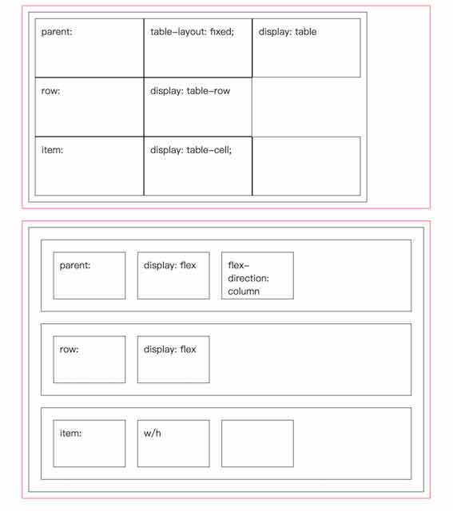

```
<html>

<head>
    <meta http-equiv="Content-Type" content="text/html; charset=utf-8" />
    <title>CSS</title>
    <script type="text/javascript">
    </script>
    <style type="text/css">
    .page-body-1 {
        width: 80%;
        margin: 20px auto;
        border: 1px solid red;
    }
    </style>
    <style type="text/css">
    .parent1 {
        padding: 10px;
        margin: 10px;
        border: 1px solid #000;
        display: table;
        table-layout: fixed;
        width: 80%;
    }

    .row1 {
        padding: 10px;
        margin: 10px;
        display: table-row;
        border: 1px solid #000;
    }

    .item1 {
        padding: 10px;
        margin: 10px;
        display: table-cell;
        width: 100px;
        height: 100px;
        border: 1px solid #000;
    }
    </style>
    <style type="text/css">
    .parent {
        padding: 10px;
        margin: 10px;
        border: 1px solid #000;
        display: flex;
        flex-direction: column;
    }

    .row {
        padding: 10px;
        margin: 10px;
        height: 100px;
        display: flex;
        border: 1px solid #000;
    }

    .item {
        padding: 10px;
        margin: 10px;
        width: 100px;
        border: 1px solid #000;
    }
    </style>
</head>

<body>
    <div class="page-body-1">
        <div class="parent1">
            <div class="row1">
                <div class="item1">parent:</div>
                <div class="item1">table-layout: fixed;</div>
                <div class="item1">display: table</div>
            </div>
            <div class="row1">
                <div class="item1">row:</div>
                <div class="item1">display: table-row</div>
            </div>
            <div class="row1">
                <div class="item1">item:</div>
                <div class="item1">display: table-cell;</div>
                <div class="item1"></div>
            </div>
        </div>
    </div>
    <div class="page-body-1">
        <div class="parent">
            <div class="row">
                <div class="item">parent:</div>
                <div class="item">display: flex</div>
                <div class="item">flex-direction: column</div>
            </div>
            <div class="row">
                <div class="item">row:</div>
                <div class="item">display: flex</div>
            </div>
            <div class="row">
                <div class="item">item:</div>
                <div class="item">w/h</div>
                <div class="item"></div>
            </div>
        </div>
    </div>
</body>

</html>
```

---

参考

+ https://segmentfault.com/a/1190000003931851