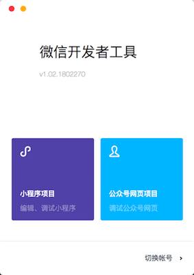
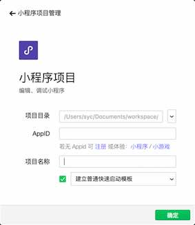
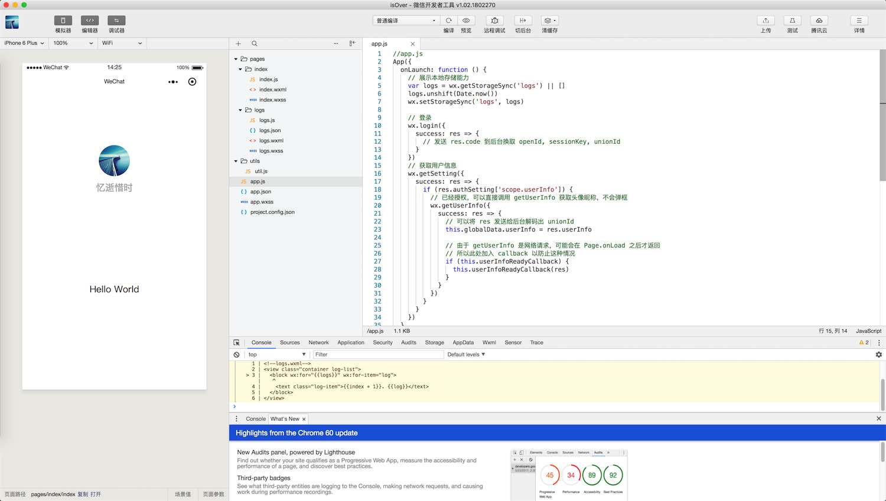

# 准备工作

## 注册账号

一个账号对应一个小程序
在 [微信公众平台](https://mp.weixin.qq.com/) 点击 [立即注册](https://mp.weixin.qq.com/cgi-bin/registermidpage?action=index&lang=zh_CN) 选择 [小程序](https://mp.weixin.qq.com/wxopen/waregister?action=step1) 填写注册信息
> 填写未被微信公众平台注册，未被微信开放平台注册，未被个人微信号绑定的邮箱 😂

注册的时候还需要微信扫码, 验证邮件

## 完善小程序

登录的时候, 需要 账号 + 微信扫码
配置小程序基本信息

## 获取 AppID

在 `设置` - `开发设置` 获取小程序 `AppID` 和密钥 `AppSecret`

## 开发工具

在 [开发者工具下载页面](https://mp.weixin.qq.com/debug/wxadoc/dev/devtools/download.html?t=2018227) 下载并安装 `微信开发者工具`
+ 打开 `微信开发者工具` 需要微信扫描登录

+ 选择 `小程序`

+ 创建项目

+ 开发 coding

## 发布

点击 右上角 `上传` 将代码上传到 `微信公众平台` 在 `开发管理` 中进行代码审核发布

# 小程序开发

## 关于文件
+ `.json` 配置文件
+ `.wxml` 模板文件(html)
+ `.wxss` 样式文件(css)
+ `.js` 脚本逻辑文件(js)

## 关于 demo

从 [微信公众平台](https://mp.weixin.qq.com/debug/wxadoc/dev/demo.html) 下载的官方 demo, 包括各种组件和接口

## 关于 API

各种标签的使用可以直接查看 [微信小程序 API](https://mp.weixin.qq.com/debug/wxadoc/dev/)

只有看了 api, 才能更好的使用各种组件,学习去吧...

# 我的小程序

[我的小程序](https://github.com/doingself/WeChatSmallApp)

---

参考

+ https://mp.weixin.qq.com/debug/wxadoc/introduction/index.html?t=1519713195
+ https://mp.weixin.qq.com/debug/wxadoc/dev/index.html?t=201818